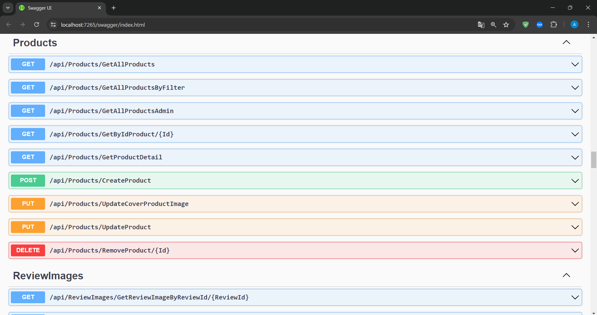

# EStoreBackend

## Overview

EStoreBackend is a backend service for managing an e-commerce platform. It is built with ASP.NET Core and provides RESTful APIs for managing products, categories, orders, and user authentication.

## Features

- **Product Management**: CRUD operations for products.
- **Category Management**: CRUD operations for product categories.
- **Order Management**: CRUD operations for customer orders.
- **User Authentication**: Secure user authentication and authorization using JWT tokens.
- **Role-Based Access Control**: Admin and user roles with different access permissions.
- **Data Validation**: Ensures the integrity of data through model validation.
- **Logging and Error Handling**: Centralized logging and error handling mechanisms.
- **Output Caching**: Implements output caching to improve performance and reduce server load.
- **Email Service**: Integration with an email service to send notifications and confirmations.
- **File Management**: Support for file upload and management, including adding images to products.

## Technologies Used

- ASP.NET Core
- Entity Framework Core
- SQL Server
- JWT Authentication
- Swagger for API documentation
- MediatR for CQRS and Mediator pattern

## Getting Started

### Prerequisites

- .NET 8 SDK
- SQL Server

### Installation

1. Clone the repository:
    ```sh
    git clone https://github.com/anilklc/EStoreBackend.git
    ```
2. Navigate to the project directory:
    ```sh
    cd EStoreBackend
    ```
3. Update the database connection string and other configurations in `appsettings.json`.
4. Apply migrations and create the database:
    ```sh
    dotnet ef database update
    ```
5. Run the application:
    ```sh
    dotnet run
    ```

### API Documentation

API documentation is available via Swagger. Once the application is running, navigate to `/swagger` to explore the available endpoints.

### Screenshots





### License

This project is licensed under the MIT License.
